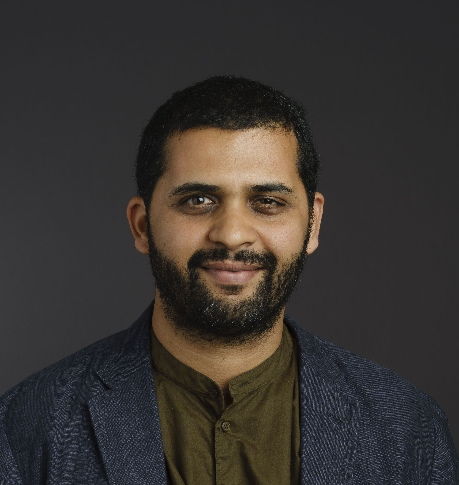

**PhD (2012), MSc (2008), Laurea Specialistica (2008)** 

**Academic, Chancellor’s Fellow, Royal Society University Research Fellow, and Alan Turing Faculty Fellow at the University of Edinburgh.**

My research is at the intersection of **machine learning** and **symbolic systems (logics, programs)**, in service of the science and technology of **artificial intelligence**. For more information, [please see the lab website](/lab/).

**Brief bio:** *Dr Vaishak Belle is a Chancellor’s Fellow and Faculty at the School of Informatics, University of Edinburgh, an Alan Turing Institute Faculty Fellow, a Royal Society University Research Fellow, and a member of the RSE (Royal Society of Edinburgh) Young Academy of Scotland. At the University of Edinburgh, he directs a research lab on artificial intelligence, specialising in the unification of symbolic systems and machine learning, with a recent emphasis on explainability and ethics. He has given research seminars at numerous academic institutions, tutorials at AI conferences, and talks at venues such as Ars Electronica and the Samsung AI Forum. He has co-authored over 50 scientific articles on AI, at venues such as IJCAI, UAI, AAAI, MLJ, AIJ, JAIR, AAMAS, and along with his co-authors, he has won the Microsoft best paper award at UAI, the Machine learning journal best student paper award at ECML-PKDD, and the Machine learning journal best student paper award at ILP. In 2014, he received a silver medal by the Kurt Goedel Society. Recently, he has consulted with major banks on explainable AI and its impact in financial institutions.* 

