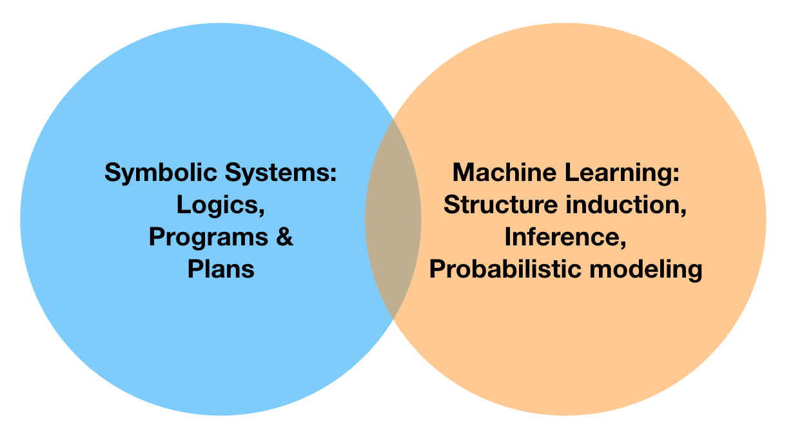

The Lab carries out research in **artificial intelligence**, by blending ideas from **machine learning, knowledge representation, causality** and **multi-agent systems**.

We are motivated by the need to augment _learning_ and _perception_ with _high-level structured, commonsensical knowledge_, to enable systems to learn faster and more accurate models of the world. We are interested in developing computational frameworks that are able to _explain their decisions, modular, re-usable_, and _robust_ to variations in problem description. A non-exhaustive list of topics include:

*   probabilistic and statistical knowledge bases
*   ethics and explainability in AI 
*   exact and approximate probabilistic inference
*   statistical relational learning and causality
*   unifying deep learning and probabilistic learning methods
*   probabilistic programming
*   numerical optimization
*   automated planning and high-level programming
*   reinforcement learning and learning for automated planning
*   cognitive robotics
*   automated reasoning
*   modal logics (knowledge, action, belief)
*   multi-agent systems and epistemic planning

For example, our recent work has touched upon: 

*   [morality in machine learning systems](https://arxiv.org/pdf/1810.03736) 
*   [tractable learning with relational logic](https://www.evernote.com/shard/s7/sh/4af8f2a4-39da-4481-89ac-c9bf614052b7/a736c308c0c434cb98ffe68650c47a52) 
*   [deep tractable probabilistic generative models](https://arxiv.org/pdf/1807.05464) 
*   [learning with missing data](https://arxiv.org/pdf/1901.05847)
*   [program learning for explainability](https://arxiv.org/pdf/1807.05527) 
*   [implementing fairness](https://arxiv.org/abs/1905.07026)
*   [model abstraction for explainability](https://arxiv.org/pdf/1810.02434) 
*   [strategies for interpretable & responsible AI](https://www.evernote.com/shard/s7/client/snv?noteGuid=ebb6675f-6eb5-455b-8e81-8a151b4f5cdc&noteKey=8fa9bbefdba6d9f99b47e6d9255fa0b3&sn=https%3A%2F%2Fwww.evernote.com%2Fshard%2Fs7%2Fsh%2Febb6675f-6eb5-455b-8e81-8a151b4f5cdc%2F8fa9bbefdba6d9f99b47e6d9255fa0b3&title=biochemist%2Barticle) 

For more information, please check our papers. 

**Principal Investigator:** [_Vaishak Belle_](http://vaishakbelle.com/)

**Postdoctoral fellows and PhD students:**

*   _Paulius Dilkas_, interested in logical abstractions
*   _Miguel Mendez Lucero_, interested in causality
*   _Jonathan Feldstein_ (with James Cheney), interested in probabilistic programming
*   _Eleanor Platt_ (with Amos Storkey), interested in interpretable deep learning
*   _Fazl Barez_ (with Helen Hastie), interested in explainable AI
*   _Giannis Papantonis_, interested in causality
*   _Ionela-Georgiana Mocanu_, interested in PAC learning
*   _Gary Smith_ (with Ron Petrick), interested in epistemic planning
*   _Anton Fuxjaeger_, interested in applications of tractable models
*   _Andreas Bueff_, interested in tractable learning and reinforcement learning
*   _Sandor Bartha_ (with James Cheney), interested in program induction
*   _Samuel Kolb_ (KU Leuven, with Luc De Raedt), interested in inference for hybrid domains

**Alumni:**

*   _Amélie Levray_ (Postdoctoral fellow), interested in tractable learning with credal networks
*   _Stefanie Speichert_ (Msc, 2018), interested in program induction
*   _Davide Nitti_ (PhD 2016, KU Leuven, with Luc De Raedt), interested in machine learning for hybrid domains
*   _Jazon Szabo_ (BSc, 2019), interested in modal logics for causality
*   _Himan Mookherjee (Msc, 2018)_ (principal supervisor: James Cheney), interested in machine learning for anomaly detection
*   _Michael Varley_ (MSc, 2018), interested in algorithmic fairness
*   _Lewis Hammond_ (MSc, 2018), interested in responsible decision making
*   _Laszlo Treszkai_ (MSc, 2018), interested in probabilistic planning
*   _Amit Parag_ (MSc by Research, 2019), interested in machine learning for physics
*   _Rose Khan_ (MSc, 2017), interested in default reasoning
*   _Nazgul Tazhigaliyeva_ (MSc, 2017), interested in model counting

**Visitors:**

*   _Esra Erdem_, Sabanci University
*   _Yoram Moses_, Technion
*   _Brendan Juba_, Washington University in St. Louis
*   _Loizos Michael_ (via the Alan Turing Institute), Open University of Cyprus
*   _Till Hoffman,_ RWTH Aachen University
